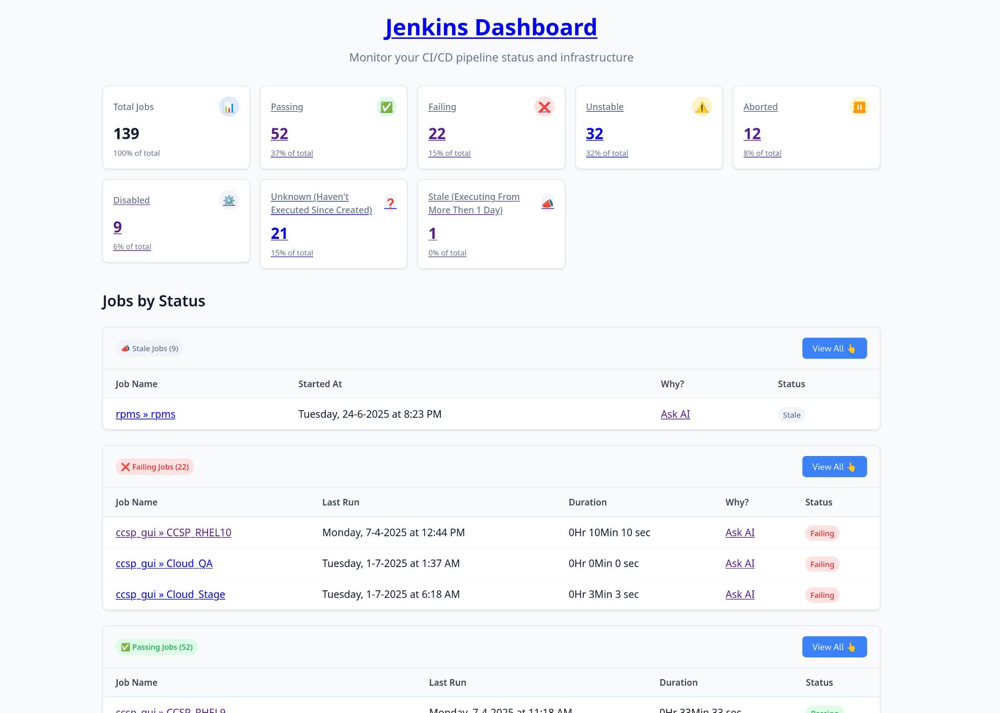

# Jenkins Dashboard - Advanced Analytics & Monitoring Solution




## 🚀 Overview

The **Jenkins Dashboard** is a powerful, lightweight analytics and monitoring solution that provides comprehensive insights into your Jenkins CI/CD pipeline. Unlike traditional Jenkins plugins, this standalone tool generates beautiful, responsive HTML dashboards with advanced job categorization and analytics capabilities.

## ✨ Key Features

### 🎯 **Comprehensive Job Analysis**
- **7-Category Job Classification**: Success, Failed, Unstable, Aborted, Disabled, Unknown, and Stale jobs
- **Stale Job Detection**: Automatically identifies jobs running for more than 24 hours
- **Health Score Monitoring**: Tracks Jenkins health reports and job reliability metrics
- **Duration Analytics**: Detailed execution time tracking and analysis

### 🔍 **Advanced Discovery Engine**
- **Recursive Folder Traversal**: Automatically discovers jobs in nested Jenkins folders
- **Multi-Project Support**: Handles both Pipeline (WorkflowJob) and Freestyle projects
- **Hierarchical Navigation**: Maintains full job hierarchy and naming conventions

### 🎨 **Modern, Responsive UI**
- **Professional Design**: Clean, modern interface with intuitive navigation
- **Interactive Statistics**: Real-time percentage calculations and visual indicators
- **Color-Coded Status**: Instant visual job status identification
- **Mobile-Friendly**: Fully responsive design for all devices

### 🔐 **Enterprise Security**
- **Authentication Support**: Username/token-based Jenkins authentication
- **SSL Configuration**: Configurable SSL verification for secure connections
- **Environment Variables**: Secure credential management via environment variables

### 📊 **Multiple Report Formats**
- **Standalone Dashboard**: Complete HTML dashboard for external hosting
- **Jenkins Integration**: Direct embedding in Jenkins job descriptions
- **Detailed Views**: Dedicated pages for each job category with filtering

### 🤖 **AI-Powered Analysis**
- **Build Log Analysis**: Integrated "Ask AI" functionality for intelligent build failure analysis
- **Smart Recommendations**: AI-driven insights for job optimization
- **Automated Troubleshooting**: Intelligent error pattern recognition

## 🏆 Why Choose This Over Other Jenkins Plugins?

### **vs. Blue Ocean Plugin**

| Feature | Jenkins Dashboard | Blue Ocean |
|---------|-------------------|------------|
| **Installation** | Zero installation, standalone | Requires plugin installation & updates |
| **Resource Usage** | Minimal, runs externally | Heavy resource consumption |
| **Customization** | Fully customizable HTML/CSS | Limited theme options |
| **Job Categories** | 7 detailed categories | Basic pass/fail status |
| **Stale Job Detection** | ✅ Advanced detection | ❌ Not available |
| **Folder Navigation** | ✅ Recursive traversal | ✅ Basic support |
| **Offline Access** | ✅ Export & view anywhere | ❌ Requires Jenkins access |

### **vs. Dashboard View Plugin**

| Feature | Jenkins Dashboard | Dashboard View |
|---------|-------------------|-----------------|
| **Modern UI** | ✅ Responsive, modern design | ❌ Outdated interface |
| **Analytics** | ✅ Comprehensive metrics | ❌ Basic status display |
| **Mobile Support** | ✅ Fully responsive | ❌ Desktop only |
| **AI Integration** | ✅ Smart analysis features | ❌ Manual troubleshooting |
| **Export Capability** | ✅ Static HTML generation | ❌ Jenkins-dependent |
| **Health Monitoring** | ✅ Trend analysis | ❌ Point-in-time data |

### **vs. Build Monitor Plugin**

| Feature | Jenkins Dashboard | Build Monitor |
|---------|-------------------|---------------|
| **Job Categorization** | ✅ 7 detailed categories | ❌ Simple status display |
| **Historical Data** | ✅ Timestamps & duration | ❌ Current status only |
| **Detailed Analytics** | ✅ Comprehensive metrics | ❌ Basic monitoring |
| **Easy Deployment** | ✅ Simple Python script | ❌ Plugin management |
| **Performance** | ✅ Lightweight | ❌ Resource intensive |

## 🚦 Quick Start

### Prerequisites
- Python 3.6+
- Jenkins server access
- `requests` library

### Installation

1. **Clone the repository**
   ```bash
   git clone https://gitlab.cee.redhat.com/certification-qe/Jenkins-Dashboard.git
   cd jenkins-dashboard
   ```

2. **Install dependencies**
   ```bash
   pip install -r requriments.txt
   ```

3. **Set environment variables**
   ```bash
   export JENKINS_SERVER_URL="https://your-jenkins-server.com"
   export USERNAME="your-jenkins-username"
   export TOKEN="your-jenkins-api-token"
   export SSL_VERIFICATION="true"  # or path to cert
   ```

4. **Generate dashboard**
   ```bash
   python generate_report.py
   ```

5. **View your dashboard**
   ```bash
   open reports/index.html
   ```

### Jenkins Pipeline Integration

Add this `Jenkinsfile` to automate dashboard generation:

```groovy
pipeline {
    agent any
    parameters {
        string(name: 'JENKINS_SERVER_URL', defaultValue: '', description: 'Jenkins Server URL')
        string(name: 'USERNAME', defaultValue: '', description: 'Jenkins Username')
        string(name: 'TOKEN', defaultValue: '', description: 'API Token')
    }
    stages {
        stage("Generate Dashboard") {
            steps {
                sh "python -m venv .venv"
                sh "source .venv/bin/activate; python generate_report.py"
            }
        }
        stage("Archive Reports") {
            steps {
                archiveArtifacts 'reports/*.html'
            }
        }
    }
}
```

## 📊 Dashboard Categories

### 🟢 **Success Jobs**
Jobs that completed successfully with comprehensive execution metrics.

### 🔴 **Failed Jobs**
Jobs that failed with detailed error tracking and AI-powered analysis suggestions.

### 🟡 **Unstable Jobs**
Jobs with test failures or warnings requiring attention.

### ⏸️ **Aborted Jobs**
Manually or automatically terminated jobs with timing analysis.

### ⚪ **Disabled Jobs**
Inactive jobs that may need cleanup or reactivation.

### ❓ **Unknown Jobs**
Jobs that haven't executed since creation, indicating potential configuration issues.

### 📣 **Stale Jobs**
Long-running jobs (>24 hours) that may be stuck or resource-intensive.

## 🛠️ Configuration Options

### Environment Variables

```bash
# Required
JENKINS_SERVER_URL=https://jenkins.example.com

# Optional
USERNAME=your-username
TOKEN=your-api-token
SSL_VERIFICATION=true|false|/path/to/cert
```

### Advanced Configuration

The tool supports various Jenkins authentication methods:
- **API Tokens**: Recommended for security
- **Username/Password**: For legacy setups
- **Certificate-based**: For enterprise environments

## 🎨 Customization

### Themes & Styling
- Modify `src/templates/theme.html` for custom branding
- Update CSS in the template for company-specific themes
- Add custom JavaScript for enhanced functionality

### Data Processing
- Extend `src/utils/jenkins.py` for additional metrics
- Customize job categorization logic
- Add integration with external monitoring systems

## 📈 Analytics & Metrics

The dashboard provides:
- **Job Success Rate**: Overall pipeline health percentage
- **Average Duration**: Performance trending analysis
- **Failure Patterns**: Common error identification

## 🔄 Integration Options

### **CI/CD Pipeline Integration**
- Automated report generation on schedule
- Integration with deployment pipelines
- Slack/Teams notifications with dashboard links ( Yet To Be Implemented )


## 📄 License

This project is licensed under the Apache License 2.0 - see the [LICENSE](LICENSE) file for details.

---

**Made with ❤️ for the Jenkins community**

*Transform your Jenkins monitoring experience with intelligent analytics and beautiful visualizations.* 
